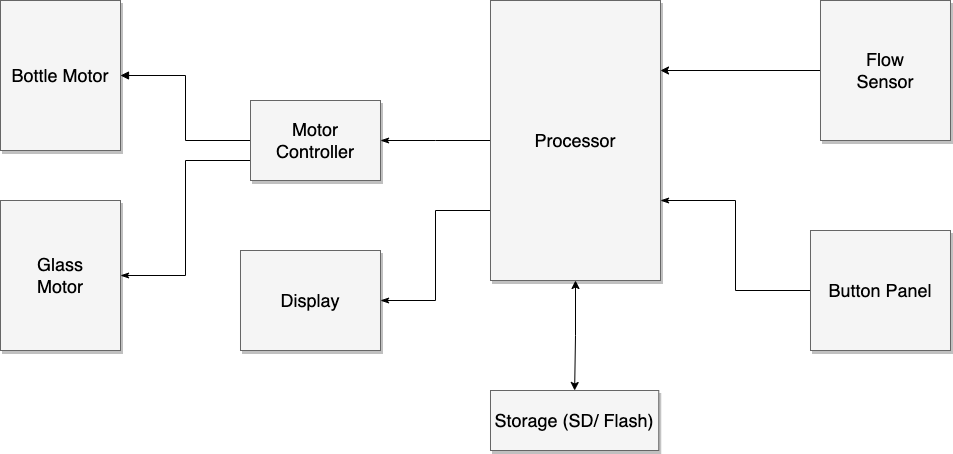

Trainable Beer Pouring Robot

- This robot will be able to log flow rates, so that it can pour a beer later as close as possible to how a user poured it
- Components
  - Motors to tilt bottle and glass
  - Flow sensor
  - button to switch modes (training / pouring)
  - button to start pouring
  - Flash Memory / SD card to store flow rates
  - LED/LCD Display to indicate status (pouring / recording / complete)

**Hardware Block Diagarm**

**Software Hiearchy Diagram**

